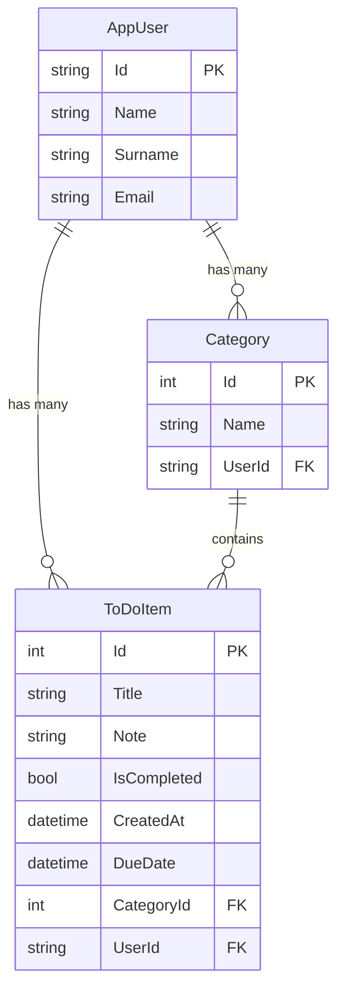

# ✅ ToDoApp

A full-stack to-do application built with ASP.NET Core MVC, providing user-based task management. Users can register and log in, create their own categories, and manage tasks associated with those categories.

---

## 📸 Features

- 🔐 **Authentication** — Registration, login, and logout via ASP.NET Core Identity
- 👤 **User-Based Data Isolation** — Each user can only view their own tasks and categories
- 📂 **Category Management** — Create, update, and delete user-specific categories
- 📝 **Task (ToDo) Management** — Add, edit, delete, and list tasks (full CRUD)
- 📅 **Due Date Tracking** — Assign due dates to tasks
- 🏷️ **Filter by Category** — Filter tasks by category
- 🔄 **AJAX Category Creation** — Create a new category without leaving the task creation form

---

## 🏗️ Architecture

The project follows **N-Tier / Layered Architecture** principles and consists of the following projects:

```
ToDoApp/
├── ToDoApp.Core            # Entities, DTOs, and Fluent API configurations
├── ToDoApp.DataAccess       # Repository pattern, DbContext, service implementations
├── ToDoApp.Business         # AutoMapper profiles, business layer
├── ToDoApp.Mvc              # MVC server-side UI layer (Controllers, Views)
├── ToDoApp.Api              # Web API layer (optional / in development)
└── ToDoApp.slnx             # Solution file
```

### Layer Details

| Layer | Responsibility |
|---|---|
| **Core** | `ToDoItem`, `Category`, `AppUser` entities; DTO classes (`LoginDto`, `RegisterDto`, `CreateToDoDto`, `UpdateToDoDto`); Fluent API configuration classes |
| **DataAccess** | `AppDbContext` (Identity-based), Generic Repository pattern (`IGenericRepository<T>`), `IToDoRepository`, `ICategoryRepository`, `IToDoService`, `ICategoryService`, `IAuthService` interfaces and their concrete implementations |
| **Business** | AutoMapper mapping profiles (`ToDoMappingProfile`) |
| **Mvc** | ASP.NET Core MVC Controllers (`AuthController`, `ToDoController`, `CategoryController`, `HomeController`), Razor Views, static files |
| **Api** | RESTful API endpoints (in development) |

---

## 🛠️ Technologies Used

| Technology | Version / Details |
|---|---|
| **.NET** | 8.0 |
| **ASP.NET Core MVC** | .NET 8 |
| **Entity Framework Core** | 8.0 (Code-First, Migrations) |
| **ASP.NET Core Identity** | User management & authentication |
| **SQL Server** | Database (LocalDB / SQL Server) |
| **AutoMapper** | 16.x — DTO ↔ Entity mappings |
| **Bootstrap** | Frontend UI framework |
| **Bootstrap Icons** | Icon set |
| **Razor Views** | Server-side HTML rendering |

---

## 🤖 AI-Assisted Development

**AI tools were used to assist with the frontend (UI) development** of this project. The creation of Razor Views, CSS design, and UI components was accelerated through AI-assisted code generation, **significantly speeding up the development process**.

> The backend architecture, database design, service layer, and business logic were entirely designed and coded by the developer.

---

## ⚙️ Setup & Running

### Prerequisites

- [.NET 8 SDK](https://dotnet.microsoft.com/download/dotnet/8.0)
- [SQL Server](https://www.microsoft.com/en-us/sql-server/sql-server-downloads) (LocalDB or full version)
- Visual Studio 2022+ or VS Code

### Steps

1. **Clone the repository:**
   ```bash
   git clone https://github.com/<your-username>/ToDoApp.git
   cd ToDoApp
   ```

2. **Configure the connection string:**

   Edit the connection string in `ToDoApp.Mvc/appsettings.json` to match your environment:
   ```json
   "ConnectionStrings": {
     "Default": "Server=.;Database=ToDoApp;Trusted_Connection=True;TrustServerCertificate=Yes;"
   }
   ```

3. **Create the database (Migration):**
   ```bash
   dotnet ef database update --project ToDoApp.DataAccess --startup-project ToDoApp.Mvc
   ```

4. **Run the application:**
   ```bash
   dotnet run --project ToDoApp.Mvc
   ```

5. Navigate to `https://localhost:5001` or `http://localhost:5000` in your browser.

---

## 📁 Project Structure (Detailed)

```
ToDoApp.Core/
├── Entities/
│   ├── AppUser.cs              # Identity-based user entity
│   ├── Category.cs             # Category entity + Fluent API config
│   └── ToDoItem.cs             # Task entity + Fluent API config
└── DTOs/Auth/
    ├── LoginDto.cs             # Login form DTO
    ├── RegisterDto.cs          # Registration form DTO
    ├── CreateToDoDto.cs        # Task creation DTO
    ├── UpdateToDoDto.cs        # Task update DTO
    ├── TodoResponseDto.cs      # Task response DTO
    └── TokenResponseDto.cs     # JWT token response DTO

ToDoApp.DataAccess/
├── Abstract/
│   ├── IGenericRepository.cs   # Generic CRUD interface
│   ├── IToDoRepository.cs      # ToDo-specific repository interface
│   ├── ICategoryRepository.cs  # Category repository interface
│   ├── IToDoService.cs         # ToDo service interface
│   ├── ICategoryService.cs     # Category service interface
│   └── IAuthService.cs         # Authentication service interface
├── Concrete/
│   ├── GenericRepository.cs    # Generic repository implementation
│   ├── ToDoRepository.cs       # ToDo repository implementation
│   ├── CategoryRepository.cs   # Category repository implementation
│   ├── ToDoService.cs          # ToDo service implementation
│   ├── CategoryService.cs      # Category service implementation
│   └── AuthService.cs          # Identity-based auth service
├── DataAcces/
│   └── AppDbContext.cs         # EF Core DbContext (IdentityDbContext)
└── Migrations/                 # EF Core migration files

ToDoApp.Business/
└── Mapping/
    └── ToDoMappingProfile.cs   # AutoMapper profile

ToDoApp.Mvc/
├── Controllers/
│   ├── HomeController.cs       # Home page
│   ├── AuthController.cs       # Register, login, logout
│   ├── ToDoController.cs       # CRUD operations + category filtering
│   └── CategoryController.cs   # Category management
├── Views/
│   ├── Home/Index.cshtml       # Home page view
│   ├── Auth/Login.cshtml       # Login page
│   ├── Auth/Register.cshtml    # Registration page
│   ├── ToDo/GetAll.cshtml      # Task listing
│   ├── ToDo/AddTodo.cshtml     # Task creation form
│   └── ToDo/UpdateTodo.cshtml  # Task update form
└── wwwroot/                    # Static files (CSS, JS, lib)
```

---

## 📊 Database Relationships



---

## 🔒 Security

- User passwords are hashed and stored by **ASP.NET Core Identity**
- Endpoints are protected with the `[Authorize]` attribute
- Users can only access **their own data** (filtered by UserId)
- CSRF protection (AntiForgeryToken) is active on all form submissions

---

## 📝 License

This project was created for educational and personal development purposes.

---

## 📬 Contact

Feel free to open an issue on GitHub for questions or suggestions.
