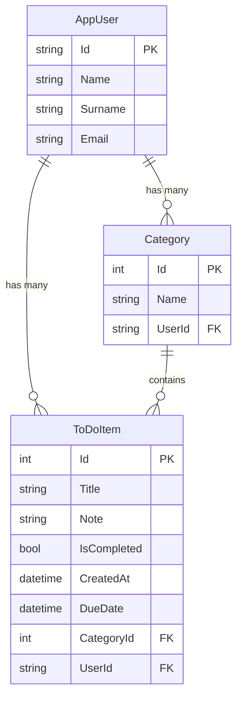

<<<<<<< HEAD
# ✅ ToDoApp

Kullanıcı bazlı görev yönetimi sağlayan, ASP.NET Core MVC ile geliştirilmiş full-stack bir yapılacaklar (To-Do) uygulamasıdır. Kullanıcılar kayıt olup giriş yapabilir, kendi kategorilerini oluşturabilir ve bu kategorilere bağlı görevlerini yönetebilir.

---

## 📸 Özellikler

- 🔐 **Kimlik Doğrulama (Authentication)** — ASP.NET Core Identity ile kayıt, giriş ve çıkış işlemleri
- 👤 **Kullanıcı Bazlı Veri İzolasyonu** — Her kullanıcı yalnızca kendi görev ve kategorilerini görüntüleyebilir
- 📂 **Kategori Yönetimi** — Kullanıcıya özel kategori oluşturma, güncelleme ve silme
- 📝 **Görev (ToDo) Yönetimi** — Görev ekleme, düzenleme, silme ve listeleme (CRUD)
- 📅 **Tarih Takibi** — Görevlere bitiş tarihi (due date) atayabilme
- 🏷️ **Kategoriye Göre Filtreleme** — Görevleri kategoriye göre filtreleme
- 🔄 **AJAX Kategori Ekleme** — Görev ekleme formundan çıkmadan yeni kategori oluşturabilme

---

## 🏗️ Mimari (Architecture)

Proje, **katmanlı mimari (N-Tier / Layered Architecture)** prensibine uygun olarak aşağıdaki projelerden oluşmaktadır:

```
ToDoApp/
├── ToDoApp.Core            # Entity, DTO ve Fluent API konfigürasyonları
├── ToDoApp.DataAccess       # Repository pattern, DbContext, servis implementasyonları
├── ToDoApp.Business         # AutoMapper profilleri, iş katmanı
├── ToDoApp.Mvc              # MVC sunucu tarafı UI katmanı (Controller, View)
├── ToDoApp.Api              # Web API katmanı (opsiyonel / geliştirme aşamasında)
└── ToDoApp.slnx             # Solution dosyası
```

### Katman Detayları

| Katman | Sorumluluk |
|---|---|
| **Core** | `ToDoItem`, `Category`, `AppUser` entity'leri; DTO sınıfları (`LoginDto`, `RegisterDto`, `CreateToDoDto`, `UpdateToDoDto`); Fluent API configuration sınıfları |
| **DataAccess** | `AppDbContext` (Identity tabanlı), Generic Repository pattern (`IGenericRepository<T>`), `IToDoRepository`, `ICategoryRepository`, `IToDoService`, `ICategoryService`, `IAuthService` arayüzleri ve bunların concrete implementasyonları |
| **Business** | AutoMapper mapping profilleri (`ToDoMappingProfile`) |
| **Mvc** | ASP.NET Core MVC Controller'ları (`AuthController`, `ToDoController`, `CategoryController`, `HomeController`), Razor View'ları, statik dosyalar |
| **Api** | RESTful API endpoint'leri (geliştirme aşamasında) |

---

## 🛠️ Kullanılan Teknolojiler

| Teknoloji | Versiyon / Detay |
|---|---|
| **.NET** | 8.0 |
| **ASP.NET Core MVC** | .NET 8 |
| **Entity Framework Core** | 8.0 (Code-First, Migrations) |
| **ASP.NET Core Identity** | Kullanıcı yönetimi & kimlik doğrulama |
| **SQL Server** | Veritabanı (LocalDB / SQL Server) |
| **AutoMapper** | 16.x — DTO ↔ Entity dönüşümleri |
| **Bootstrap** | Frontend UI framework |
| **Bootstrap Icons** | İkon seti |
| **Razor Views** | Sunucu tarafı HTML render |

---

## 🤖 AI Destekli Geliştirme

Bu projenin **frontend (UI) tarafının geliştirilmesinde yapay zeka (AI) araçlarından** yararlanılmıştır. Razor View'ların, CSS tasarımının ve kullanıcı arayüzü bileşenlerinin oluşturulması sürecinde AI destekli kod üretimi kullanılarak **geliştirme süreci önemli ölçüde hızlandırılmıştır**.

> Backend mimarisi, veritabanı tasarımı, servis katmanı ve iş mantığı tamamen geliştirici tarafından tasarlanmış ve kodlanmıştır.

---

## ⚙️ Kurulum ve Çalıştırma

### Gereksinimler

- [.NET 8 SDK](https://dotnet.microsoft.com/download/dotnet/8.0)
- [SQL Server](https://www.microsoft.com/en-us/sql-server/sql-server-downloads) (LocalDB veya tam sürüm)
- Visual Studio 2022+ veya VS Code

### Adımlar

1. **Depoyu klonlayın:**
   ```bash
   git clone https://github.com/<kullanıcı-adınız>/ToDoApp.git
   cd ToDoApp
   ```

2. **Connection string'i yapılandırın:**

   `ToDoApp.Mvc/appsettings.json` dosyasındaki bağlantı dizesini kendi ortamınıza göre düzenleyin:
   ```json
   "ConnectionStrings": {
     "Default": "Server=.;Database=ToDoApp;Trusted_Connection=True;TrustServerCertificate=Yes;"
   }
   ```

3. **Veritabanını oluşturun (Migration):**
   ```bash
   dotnet ef database update --project ToDoApp.DataAccess --startup-project ToDoApp.Mvc
   ```

4. **Uygulamayı çalıştırın:**
   ```bash
   dotnet run --project ToDoApp.Mvc
   ```

5. Tarayıcınızda `https://localhost:5001` veya `http://localhost:5000` adresine gidin.

---

## 📁 Proje Yapısı (Detaylı)

```
ToDoApp.Core/
├── Entities/
│   ├── AppUser.cs              # Identity tabanlı kullanıcı entity'si
│   ├── Category.cs             # Kategori entity + Fluent API config
│   └── ToDoItem.cs             # Görev entity + Fluent API config
└── DTOs/Auth/
    ├── LoginDto.cs             # Giriş formu DTO
    ├── RegisterDto.cs          # Kayıt formu DTO
    ├── CreateToDoDto.cs        # Görev oluşturma DTO
    ├── UpdateToDoDto.cs        # Görev güncelleme DTO
    ├── TodoResponseDto.cs      # Görev yanıt DTO
    └── TokenResponseDto.cs     # JWT token yanıt DTO

ToDoApp.DataAccess/
├── Abstract/
│   ├── IGenericRepository.cs   # Generic CRUD arayüzü
│   ├── IToDoRepository.cs      # ToDo'ya özel repository arayüzü
│   ├── ICategoryRepository.cs  # Kategori repository arayüzü
│   ├── IToDoService.cs         # ToDo servis arayüzü
│   ├── ICategoryService.cs     # Kategori servis arayüzü
│   └── IAuthService.cs         # Kimlik doğrulama servis arayüzü
├── Concrete/
│   ├── GenericRepository.cs    # Generic repository implementasyonu
│   ├── ToDoRepository.cs       # ToDo repository implementasyonu
│   ├── CategoryRepository.cs   # Kategori repository implementasyonu
│   ├── ToDoService.cs          # ToDo servis implementasyonu
│   ├── CategoryService.cs      # Kategori servis implementasyonu
│   └── AuthService.cs          # Identity tabanlı auth servisi
├── DataAcces/
│   └── AppDbContext.cs         # EF Core DbContext (IdentityDbContext)
└── Migrations/                 # EF Core migration dosyaları

ToDoApp.Business/
└── Mapping/
    └── ToDoMappingProfile.cs   # AutoMapper profili

ToDoApp.Mvc/
├── Controllers/
│   ├── HomeController.cs       # Ana sayfa
│   ├── AuthController.cs       # Kayıt, giriş, çıkış
│   ├── ToDoController.cs       # CRUD işlemleri + kategori filtreleme
│   └── CategoryController.cs   # Kategori yönetimi
├── Views/
│   ├── Home/Index.cshtml       # Ana sayfa view'ı
│   ├── Auth/Login.cshtml       # Giriş sayfası
│   ├── Auth/Register.cshtml    # Kayıt sayfası
│   ├── ToDo/GetAll.cshtml      # Görev listeleme
│   ├── ToDo/AddTodo.cshtml     # Görev ekleme formu
│   └── ToDo/UpdateTodo.cshtml  # Görev güncelleme formu
└── wwwroot/                    # Statik dosyalar (CSS, JS, lib)
```

---

## 📊 Veritabanı İlişkileri



---

## 🔒 Güvenlik

- Kullanıcı şifreleri **ASP.NET Core Identity** tarafından hash'lenerek saklanır
- `[Authorize]` attribute'u ile korunan endpoint'ler
- Kullanıcılar yalnızca **kendi verilerine** erişebilir (UserId bazlı filtreleme)
- CSRF koruması (AntiForgeryToken) form gönderimlerinde aktif

---

## 📝 Lisans

Bu proje eğitim ve kişisel gelişim amacıyla oluşturulmuştur.

---

## 📬 İletişim

Sorularınız veya önerileriniz için GitHub üzerinden issue açabilirsiniz.
=======
# ToDoApp
>>>>>>> c2f7d810c1519d1e3224581ce4c3f67f3853267a
